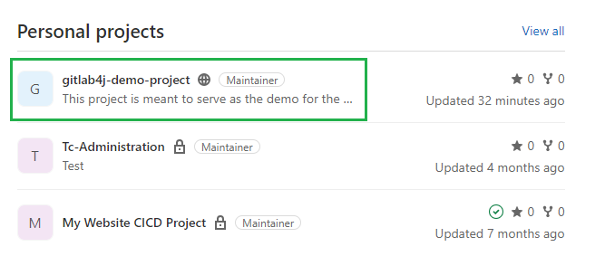
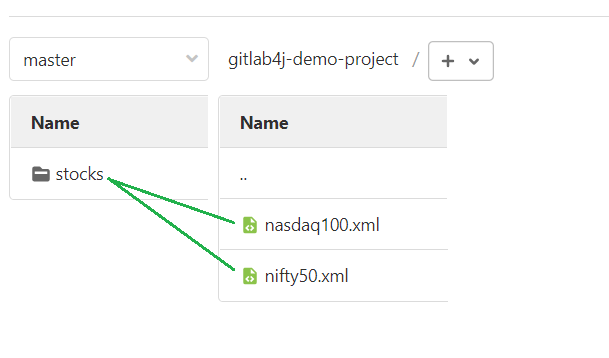
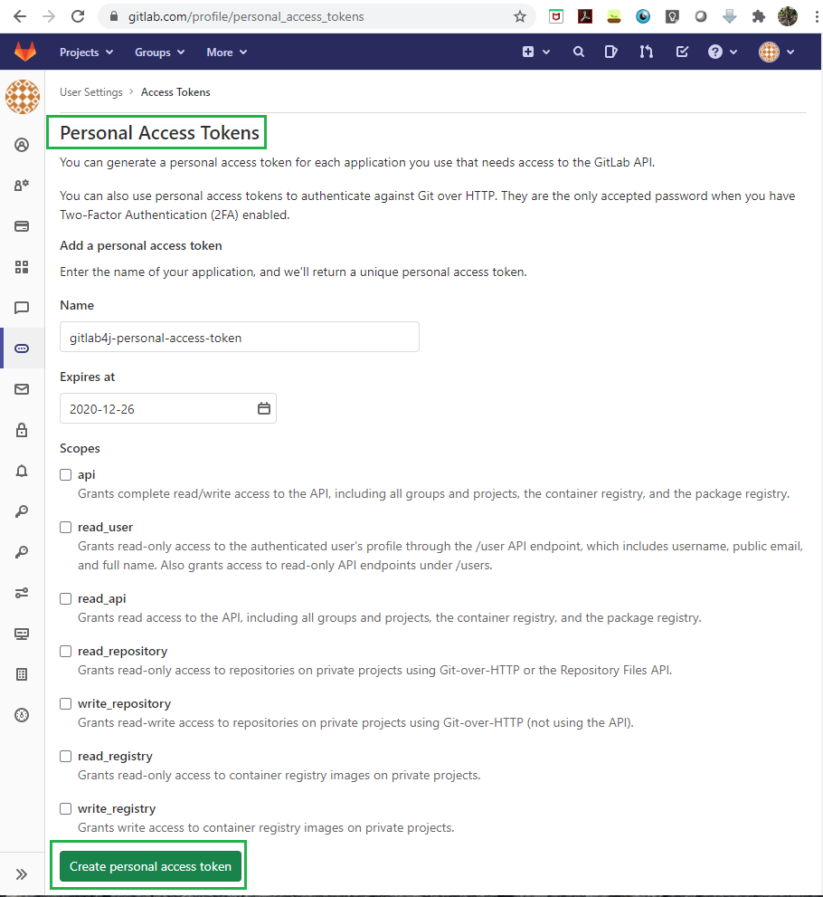
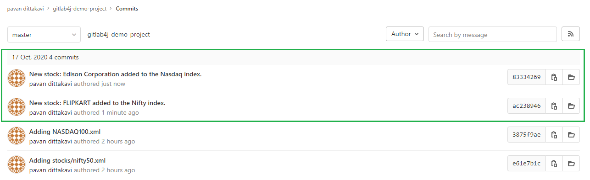
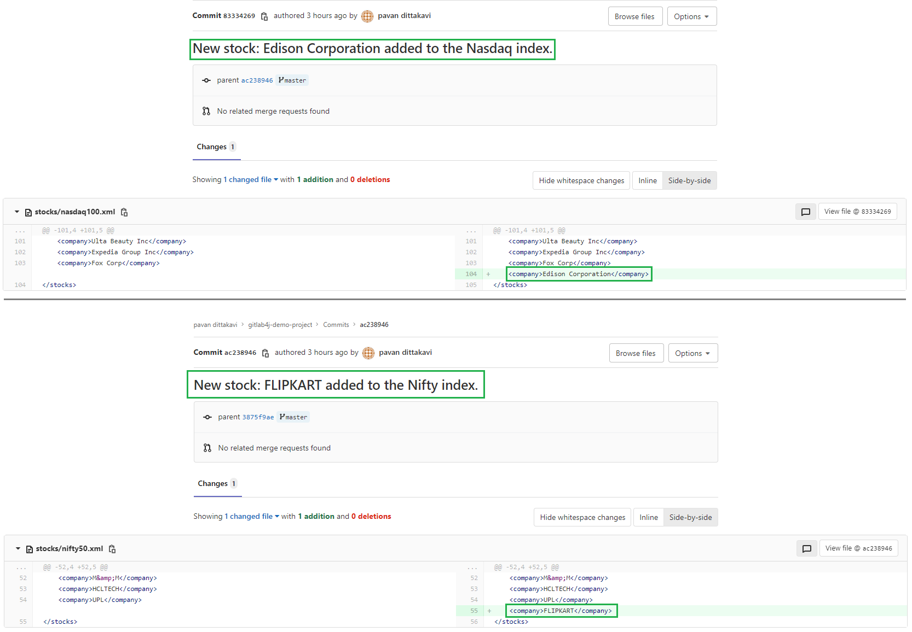

# Project Overview
gitlab-java-integration, is a project that connects to Gitlab source repositories via Gitlab4J Java API and does update to the source code in it leaving a commit message. This is a very useful reference for beginners who would want to use such programmatical access to their source code bases in Gitlab.

## Depedendent Gitlab4J jar files
This project is dependent on the Gitlab4J jar files for interacting with Gitlab source repositories. Visit [Gitlab4J](https://github.com/gitlab4j/gitlab4j-api) for more information.

## Building Gitlab4J for dependency files
Gitlab4J exposes `pom.xml` which you can use for building depdendent jar files via maven. The command to use is `mvn clean -DskipTests dependency:copy-dependencies package`. The `-DskipTests` is for skipping the unit tests that come bundled with the Gitlab4J repository.

# Deep dive

## Gitlab - Project Structure
I have created few projects in Gitlab.com free account. As of this project, they look as shown below. We will be working with the one in green - `gitlab4j-demo-project`.

There is a single folder in this project called 'stocks' and that folder will have two xml files - Nasdaq100.xml and Nifty50.xml, as shown below. 
Note that I am only working on `master` branch all the time.

## Gitlab - Personal Access Token Creation
Since we are interested in connecting to Gitlab programmatically, we need to create an access token which can be used in our code. 

## Programmatical Updates & Commits
When the `GitlabIntegrationDriver.java` is run, it connects to Gitlab via user authorization token and then makes an update to both the files in the Gitlab repository, by adding a new entry to the two indexes.

Upon exploring the commits individually, you can see that the `GitlabIntegrationDriver.java` has made two updates
1. Addition of a stock called 'FLIPKART' to the Indian index Nifty50 and
2. Addition of another stock called 'Edison Corporation' to the American index Nasdaq100.

You can see this commit information in more detail here:

# Conclusion
This example just lists out a simple usecase involvin Gitlab4J. I see that there are many other activities that one can do using these APIs. For example, creation of new branches, cloning of repositories etc. This example shall serve as a quick reference guide to you to get started.
