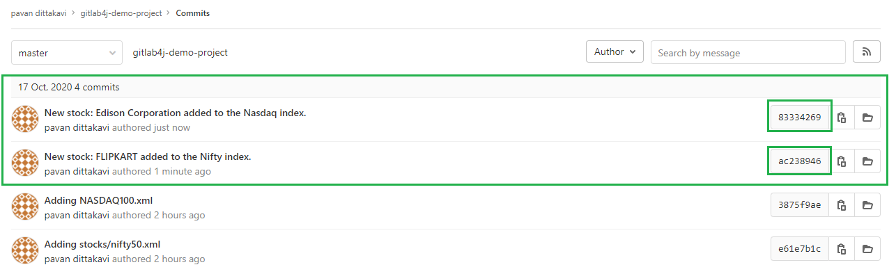

# gitlab-java-integration
A project that connects to Gitlab source repositories via Gitlab4J API and does update to the source code in it leaving a commit message.

## Depedendent Gitlab4J jar files
This project is dependent on the Gitlab4J jar files for interacting with Gitlab source repositories. Visit [Gitlab4J](https://github.com/gitlab4j/gitlab4j-api) for more information.

## Building Gitlab4J for dependency files
Gitlab4J exposes `pom.xml` which you can use for building depdendent jar files via maven. The command to use is `mvn clean -DskipTests dependency:copy-dependencies package`. The `-DskipTests` is for skipping the unit tests that come bundled with the Gitlab4J repository.

# Project overview
I have created a few projects in Gitlab.com free account. As of this project, they look as shown below.

In this project, I maintain two files, Nasdaq100.xml and Nifty50.xml, representing the top 100 and the top 50 stocks in that index respectively. Refer below for more information.

When the `GitlabIntegrationDriver.java` is run, it connect to Gitlab via user authorization token and then makes an update to both the files in the Gitlab repository, by adding a new entry to the two indexes. Notice now the below commit messages.

Upon exploring the commits individually, you can see that the `GitlabIntegrationDriver.java` has made two updates
1. Addition of a stock called 'FLIPKART' to the Indian index Nifty50 and
2. Addition of another stock called 'Edison Corporation' to the American index Nasdaq100.

You can see this commit information in more detail here:

# Conclusion
This example just lists out a simple usecase involvin Gitlab4J. I see that there are many other activities that one can do using these APIs. For example, creation of new branches, cloning of repositories etc. This example shall serve as a quick reference guide to you to get started.
